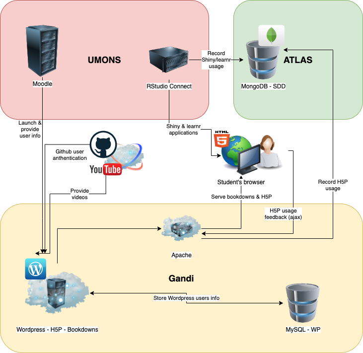

# Organisation générale {#general}

```{r setup, include=FALSE, echo=FALSE, message=FALSE, results='hide'}
knitr::opts_chunk$set(comment = '#', fig.align = "center")
#SciViews::R
```

La plateforme pédagogique LearnIt::R est constituée d'un ensemble d'outils logiciels et de services permettant de créer des cours interactifs en ligne. Dans sa version complète, elle est complexe. Heureusement, vous pouvez vous approprier ses différentes fonctionnalités progressivement. Une version centrée sur [GitHub](https://github.com), appelée pour cette raison **LearnIt::R GitHub**, ne nécessite pas l'installation de serveurs spécialisés, ni de base de données. Nous conseillons de commencer par cette version. **LearnIt::R LRS** est une version plus complète qui nécessite l'installation d'une base de données (LRS pour *Learning Record Store*) pour collecter les traces de l'activité des étudiants en temps réel. Cette base de données ouvre à d'autres possibilités qui sont exploitées pour offrir une vision plus complète et en temps réel de la progression des étudiants. Par la suite, ces deux versions sont décrites successivement.

Avant d'installer la plateforme LearnIt::R, vous devez configurer un environnement logiciel basé autour de R et de RStudio pour vous, mais aussi pour vos étudiants (tout du moins si l'apprentissage de R fait partie de votre cours).

- [R](https://www.r-project.org) est un logiciel Open Source de statistique, visualisation et manipulation des données. C'est le langage principal des outils composant LearnIt::R. Si votre cours vise, entre autres, à enseigner R à vos étudiants, ce langage informatique ne vous est pas étranger. Vous n'aurez pas à apprendre un autre langage pour accéder aux fonctionnalités de la plateforme LearnIt::R. R est un logiciel puissant et gratuit que l'étudiant pourra s'approprier pour faire ensuite ses analyses tout au long de sa carrière s'il le souhaite. Il est détaillé au chapitre \@ref(r).

- [RStudio](https://rstudio.com/products/rstudio/) est un environnement de développement intégré (IDE pour "*integrated development environment*" en anglais) gratuit. Il permet aux étudiants de réaliser leurs exercices en R facilement. Une version Desktop est installable localement sur un ordinateur. La version serveur permet de travailler dans une interface utilisateur identique à peu de choses près sur le cloud. Couplé à [R Markdown](https://rmarkdown.rstudio.com) ou [Quarto](https://quarto.org), RStudio permet d'éditer du code R et d'écrire des rapports ou autres documents dans un environnement unique. Son installation et son utilisation dans le cadre d'un cours sont discutés au chapitre \@ref(r).

## LearnIt::R GitHub

La plateforme LearnIt::R GitHub est constituée essentiellement de solutions accessibles gratuitement et utilise les fonctionnalités de GitHub (et de GitHub Classroom) pour l'échange et la centralisation de l'information. Bien que ce ne soit pas une obligation, elle est conçue pour être utilisée avec R et de RStudio décrits plus haut. Les packages R {quarto}, {learnr}, {shiny} et {learnitdown} forment la base de ses fonctionnalités. Pas de panique si tous ces termes vous sont inconnus : nous allons les expliquer l'un après l'autre. Leur utilisation sera ensuite détaillée chapitre après chapitre dans la section consacrée à LearnIt::R GitHub pour que vous puissiez implémenter la plateforme de manière graduelle en maîtrisant un outil après l'autre.

- [Git](https://git-scm.com) est un système de gestion de version largement utilisé en programmation. Combiné à R, RStudio et R Markdown, il permet de travailler de manière *reproductible*. L'utilisation de git peut être assez complexe, mais en se restreignant à des actions simples et aux outils git disponibles dans RStudio, il est possible de l'utiliser dans vos cours, même avec des étudiants peu versés en informatique au départ. La maîtrise, même minimale, de git est un plus pour les étudiants qui apprennent et utiliseront plus tard le langage R. L'objectif est d'amener vos étudiants à prendre de bonnes habitudes en matière de traçabilité et reproductibilité de leurs analyses. [GitHub](https://github.com) est un hébergement et lieu d'échange de dépôts git sur le cloud. Une bonne partie des ses fonctionnalités sont accessibles gratuitement. Il est puissant, universellement utilisé et il est couplé à RStudio. L'interface git et GitHub de RStudio rend l'utilisation de ces deux logiciels plus simple. [GitHub Desktop](https://desktop.github.com) pourra éventuellement compléter l'ensemble pour effectuer des tâches non reprises dans l'interface git de RStudio s'il n'est pas prévu de recourir à la ligne de commande (qui est tout de même la manière la plus efficace d'utiliser git). Enfin, [GitHub Classroom](https://classroom.github.com) est une extension permettant de gérer les dépôts créés pour vos étudiants dans le cadre de vos cours. Ces différentes briques logicielles sont présentées au chapitre \@ref(git).

- [Bookdown](https://bookdown.org) est un type de sortie R Markdown multi-documents qui permet d'intégrer directement des calculs et des graphiques de R. Vous pouvez l'utiliser comme moyen de centraliser facilement tout votre matériel pédagogique et l'organiser en modules. Ces modules formeront autant de chapitres différents du bookdown. LearnIt::R propose, par l'intermédiaire du package [{learnitdown}](https://github.com/learnitr/learnitdown), des fonctionnalités supplémentaires pour y intégrer vos exercices ou du contenu contextuel (voir \@ref(bookdown)). et notamment des widgets H5P (voir \@ref(h5p)) et des applications Shiny (voir \@ref(shiny)). Le chapitre \@ref(bookdown) est entièrement consacré à bookdown.

- [H5P](https://h5p.org) propose une large variété de contenus javascript intégrables dans une page web et donc dans vos contenus bookdown pour varier et rendre plus efficace l'apprentissage. Sans l'installation d'un serveur dédié, vous pouvez créer du contenu sur [H5P.org](https://h5p.org) ou utiliser un service payant plus complet sur [H5P.com](https://h5p.com). Si votre institution utilise Moodle, H5P fournit un plugin qui permet d'intégrer ce type d'exercice dans Moodle, mais alors, vous ne pourrez pas les placer directement dans votre bookdown (vous utiliserez un lien qui ouvrira la ressource correspondante dans Moodle). Voyez le chapitre \@ref(h5p) pour plus de détails.

- [Shiny](https://shiny.rstudio.com) permet de créer des applications interactives dans un browser web avec R. Les possibilités sont pratiquement sans limites pour démontrer les concepts "en live" à vos étudiants. Les applications Shiny sont intégrables dans bookdown, mais elles doivent être exécutées sur un serveur dédié (version LearnIt::R LRS). Avec LearnIt::R GitHub, nous intègrons des descriptions de ces applications dans le bookdown et les étudiants doivent ensuite lancer les apps dans leur session R par eux mêmes. Le chapitre \@ref(shiny) est consacré à ces applications Shiny et la manière de les mettre en œuvre dans vos cours.

- les tutoriels [learnr](https://rstudio.github.io/learnr/index.html)s forment un type particulier d'applications Shiny. Ces documents interactifs présentent des exercices dans R et des questions à choix multiples aux étudiants. Ils sont idéaux pour initier à la programmation en R. À ce titre, ils représentent un élément central de l'apprentissage dans LearnIt::R. La correction automatique des exercices learnr est possible grâce au package [{gradethis}](https://github.com/rstudio/gradethis). Le chapitre \@ref(learnr) détaille l'utilisation des tutoriels learnr.

- Enfin, le package [{learnitgrid}](https://github.com/learnitr/learnitgrid) a été écrit spécialement pour faciliter la correction des rapports de vos étudiants dans les projets GitHub Classroom. Le chapitre \@ref(projets) est entièrement consacré à l'utilisation de GitHub Classroom et de {learnitgrid} pour gérer les projets des étudiants.

## LearnIt::R LRS

La version complète de la plateforme LearnIt::R, appelée LearnIt::R LRS, nécessite l'installation d'une base de données [MongoDB](https://www.mongodb.com) pour récupérer les traces de l'activité des étudiants en temps réel. Cette base de données ouvre d'autres possibilités pour collecter, visualiser et traiter les informations relative à la progression de vos étudiants. Naturellement, des adaptations des autres outils sont nécessaires pour les faire fonctionner avec cette base de données. Vous pourrez utiliser MongoDB sur vos propres serveurs, ou utiliser [MongoDB Atlas](https://account.mongodb.com), voire même les deux ensemble. Tout cela est expliqué au chapitre \@ref(lrs).

- Le matériel du cours en ligne écrit en bookdown doit être intégré dans un serveur [Wordpress](https://fr.wordpress.com) qui implémente des fonctionnalités côté serveur pour l'identification des utilisateurs et l'envoi des données à la base de données MongoDB. Vos contenus H5P sont alors gérables depuis Wordpress et un plugin Wordpress [H5PxAPIkatchu](https://wordpress.org/plugins/h5pxapikatchu/) offre la possibilité d'enregistrer toute l'activité de vos étudiants dans les exercices H5P intégrés au bookdown. Voyez le chaptire \@ref(wordpress) pour son installation et utilisation, aisni que les adaptations que cela nécessite pour les exercices H5P.

- [Moodle](https://moodle.umons.ac.be) est une plateforme d'apprentissage en ligne largement utilisée dans diverses institutions. LearnIt::R LRS peut récupérer (de manière optionnelle) les informations relatives à vos étudiants à partir de Moodle pour compléter sa table des utilisateurs. L'étudiant doit lier son cours à Moodle avant de faire quoi que ce soit d'autre, comme expliqué au chapitre \@ref(moodle). Plusieurs autres ofnctionnalités de Moodle complètent la plateforme LearnIt::R, mais aucune n'est indispensable. Elle ne **nécessite pas* Moddle pour fonctionner.

- Un serveur [Posit Connect](https://posit.co/products/enterprise/connect/) peut être installé (payant et assez cher, mais une licence enseignement gratuite est proposée sous certaines conditions) pour servir vos différents applications Shiny et learnr. Le chapitre \@ref(connect) discute de son utilité dans le cadre de la plateforme LearnIt::R LRS.

- Un rapport de progression à l'usage des étudiants est implémenté dans le package [{learnitprogress}](https://github.com/learnitr/learnitprogress). Il est utile pour que les étudiants puissent clairement voir où ils en sont dans leur apprentissage. Voyez le chapitre \@ref(progression) pour son utilisation.

- Enfin, un tableau de bord destiné aux enseignants est fourni par le package [{leanitdashboard}](https://github.com/learnitr/learnitdashboard). Il permet le suivi de l'apprentissage du côté enseignant et il est utile également pour repérer rapidement les étudiants en décrochage ou les autres problèmes (parties du cours plus difficiles, ou lacunes dans les exercices). Le chapitre \@ref(dashboard) est consacré à son utilisation.

```{block2, type="info"}
Ces nombreux outils et services devant collaborer entre eux pour fournir un environnement d'apprentissage complet et cohérent, il est important de les configurer et de les inter-connecter correctement. La façon de le faire est détaillée dans la seconde partie de cet ouvrage consacrée à LearnIt::R LRS.
```



## Outils supplémentaires

- Les vidéos relatives à vos cours pourront être hébergées par exemple sur Youtube, voyez par exemple le [canal BioDataScience_Course](https://www.youtube.com/channel/UCT5UQDG5bP9YtSgBpvoRdPg). Le chapitre \@ref(videos) explique en détails comment créer ces vidéos et avec quels outils.

- Les exercices de type "questionnaire à choix multiple" ou autres peuvent être créés avec [Wooclap](https://www.wooclap.com). Ce service en ligne permet d'écrire des exercices interactifs à la volée pour animer vos séances en présentiel. À ce titre, ils sont complémentaires aux exercices H5P qui doivent, eux, être écrits et testés bien avant leur utilisation. Les résultats des étudiants sont collectés dans des rapports qui peuvent être visualisés en temps réel. Cet outil est idéal pour "prendre le pouls de votre classe". Le chapitre \@ref(wooclap) est consacré à son utilisation.

Les chapitres suivants détaillent l'installation, l'incorporation dans des cours et l'utilisation des différents outils logiciels listés ci-dessus. L'ordre des chapitres correspond à une progression logique dans la mise en place de la plateforme LearnIt::R. Vous pouvez bien sûr sauter des chapitres si vous n'avez pas besoin de certaines fonctionnalités. Les chapitres sont conçus, pour la plupart, pour être lus de manière indépendante les uns des autres.
