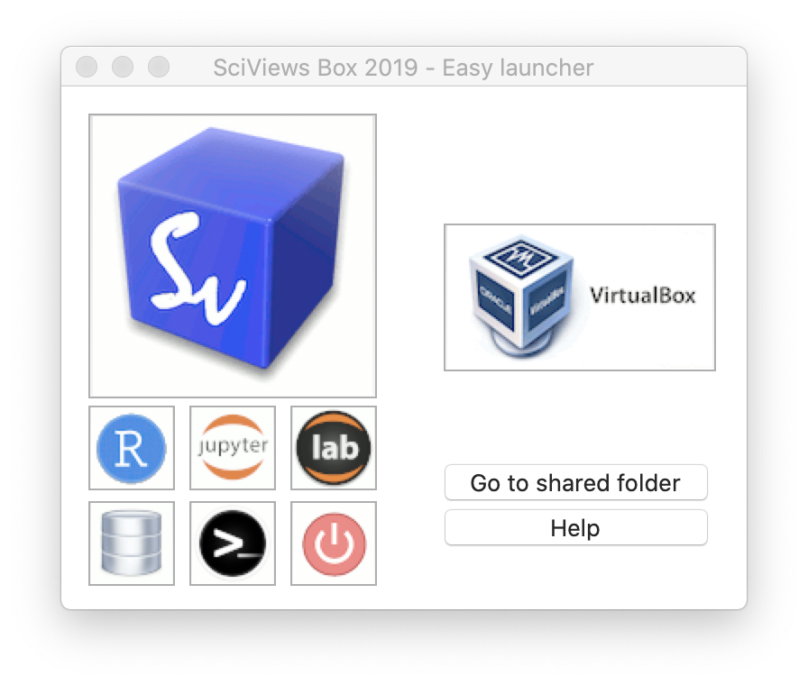

# R & RStudio {#r}

TODO: expliquer les différentes façons d'avoir un système opérationnel avec R + RStudio + packages requis :

- Installation en local, Windows, maOS et Linux

- Utilisation de RStudio Cloud

- SaturnCloud

- VirtualBox

- Docker/Podman

- SciViews Box

- Avantage et inconvénients des différentes solutions

(texte à modifier relatif à VirtualBox et la SciView Box)

- La [SciViews Box](https://www.sciviews.org/software/svbox/) est une machine virtuelle sous [VirtualBox](https://www.virtualbox.org) totalement préconfigurée. Nous créons une SciViews Box chaque année avec tous les logiciels nécessaires aux étudiants mais pas seulement : il s'agit aussi d'une machine virtuelle permettant de réaliser de nombreuses analyses de façon parfaitement reproductible. Faire installer tous les logiciels nécessaires par les étudiants n'est pas possible. Plusieurs solutions s'offrent à nous pour proposer un environnement logiciel préconfiguré pour les cours :
    * Utiliser [RStudio cloud](https://rstudio.cloud) serait la solution la plus simple au départ car l'étudiant n'a qu'à se connecter et c'est parti. Même avec un Chromebook, il peut travailler sur sa session RStudio Cloud. Cependant, la session n'est disponible *que* pour le cours et l'étudiant doit tout installer sur son ordinateur ensuite s'il veut continuer à utiliser R, RStudio et Git/GitHub (par exemple, dans le cadre de son mémoire). Or précisément, il n'a jamais appris à installer ces outils. Cela nous parait être une barrière importante à l'adoption de ces outils logiciels au-delà du cours, même si beaucoup de (grandes) universités ont choisi cette voie.
    * Utiliser [Docker](https://www.docker.com) et [Rocker](https://github.com/rocker-org/rocker) qui est une solution de containerisation pour R et RStudio. Si ces outils fonctionnent bien en production, nous les avons trouvés moins pratiques que la machine virtuelle pour nos étudiants, surtout dans un contexte où la quasi-totalité des ordinateurs utilisés sont sous Windows ou MacOS (Docker fonctionne particulièrement bien dans un environnement Linux au départ). L'installation et la gestion de containers Dockers est simple pour un utilisateur pointu, mais nous, nous démarrons avec certains étudiants qui ont une connaissance bien moins technique de l'informatique. La moindre action d'installation ou de configuration, aussi simple soit-elle, parait démesurément complexe à leurs yeux. Il faut donc démarrer avec de l'**ultra-simple**, autrement dit, fonctionnel directement ou s'auto-installant, auto-configurant tout seul.
    * Déléguer le calcul sur le cloud à travers [Binder](https://mybinder.org). Aujourd'hui, il est très facile d'exécuter du code dans un document Jupyter ou R Markdown via ce service gratuit sur le cloud. Et c'est effectivement d'un accès ultra-simple du côté de l'utilisateur qui n'a qu'à cliquer sur un lien pour lancer l'application. Au moins un format de cours en ligne y recoure ([template par Ines Montani](https://github.com/ines/course-starter-r), voir par exemple pour un cours concret en R, [Supervised Machine Learning Case Studies in R](https://supervised-ml-course.netlify.app)). Nous l'avons testé, mais l'avons jugé à l'usage trop lent au démarrage et trop limité ensuite. De plus, comme pour RStudio Cloud, les étudiants n'ont aucun logiciel utilisable sur leur PC pour travailler ensuite. La simplicité au départ ne fait donc que repousser la difficulté ultérieurement de devoir quand même installer R, RStudio, git, etc. sur son PC.
    * Enfin, la solution de la machine virtuelle avec la SciViews Box nous permet d'offrir une série de logiciels préconfigurés en version serveur et/ou locale avec interface graphique sous [Xubuntu](https://xubuntu.org). C'est une bonne base, mais l'installation était encore un peu laborieuse lorsqu'elle devait se faire à la main dans VirtualBox (on en revient pratiquement à des difficultés similaires à Docker, par exemple). Nous avons donc conçu des logiciels annexes d'installation et de lancement de la machine virtuelle de sorte que celle-ci ne soit qu'à un clic de souris (ou presque) pour nos étudiants débutants\ ! A l'usage, cela fonctionne très bien. Nous avons un lanceur rapide par édition de SciViews Box, et ce, à la fois sous Windows et sous MacOS. L'étudiant a un logiciel réellement installé sur son PC, qu'il peut parfaitement continuer à utiliser au delà des cours eux-mêmes.

