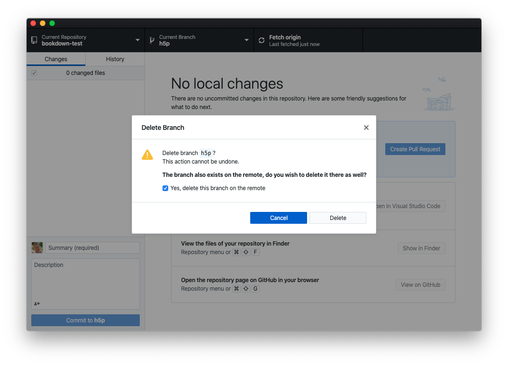

# (PART) LearnIt::R GitHub {.unnumbered}

# Git & GitHub {#git}


Le présent chapitre entame la section consacrée à **LearnIt::R GitHub**, nous abordons le déploiement et l'utilisation de logiciels utiles pour l'apprentissage, entre autres, des statistiques, de la science de données et de R sans recourir à des serveurs spécialisés qui nécessitent des compétences en administration système. Nous nous concentrons sur des solutions "relativement" simples à mettre en œuvre, à la portée de tout enseignant ou formateur qui maîtrise déjà la programmation en R. Même si vos projets sont plus ambitieux et que vous souhaitez implémenter la version LearnIt::R LRS complète à terme, nous vous conseillons d'incorporer les outils de LearnIt::R *progressivement* dans vos formations, et donc, de commencer avec cette mouture plus simple.

TODO: ce chapitre doit encore être rédigé.


## Astuces Git et GitHub

Quelques astuces utiles dans le cadre de l'utilisation de git et GitHub en cours :

- Comparaison de branches sur GitHub : ajouter `/compare` à la fin de l'URL du dépôt et une page de comparaison de branches apparait. Sinon, cette comparaison est aussi possible dans GitHub Desktop (menu `Branch -> Compare to Branch`).

- Lorsqu'une branche n'est plus utile, elle peut être facilement éliminée depuis GitHub Desktop (entrée de menu `Branch -> Delete...`). Cette branche doit être activée d'abord, et tous les commits doivent avoir été pushés. Il est conseillé d'éliminer la branche sur le serveur en même temps que la branche locale.



- Changement de gestion de dépôts GitHub de HTTPS à SSH :

```
git remote -v
# Si on a quelque chose comme: origin https://github.com/org/repo.git on est en HTTPS
# faire:
git remote set-url origin git@github.com:org/repo.git
```

