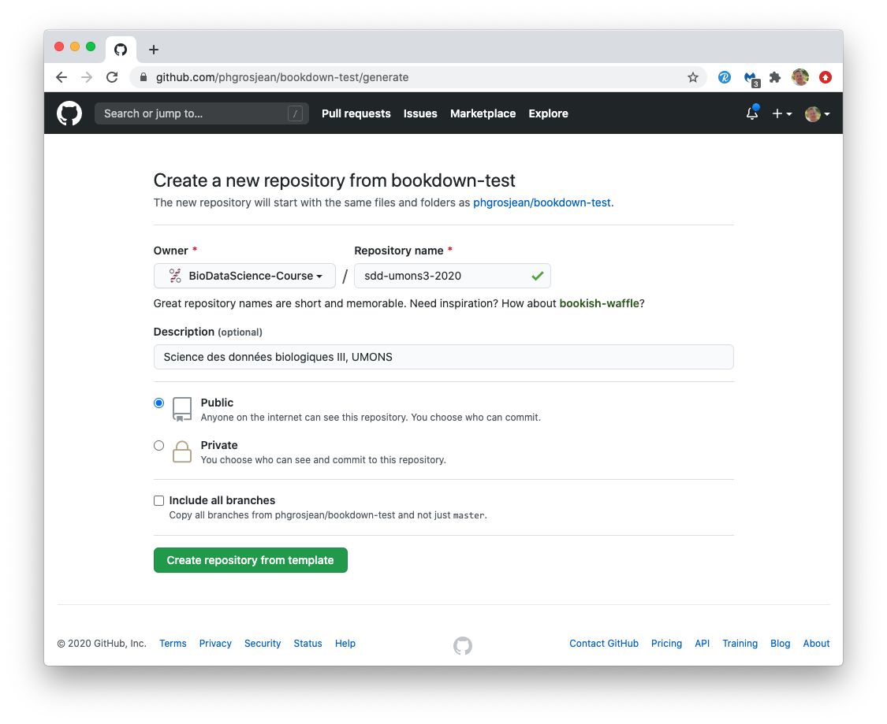
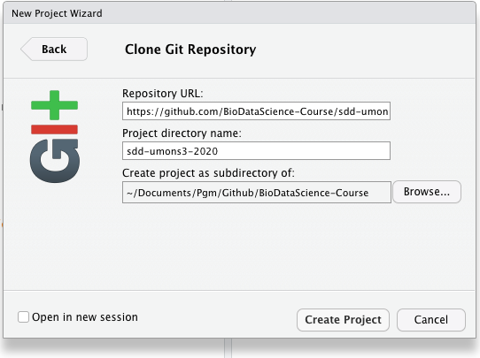

# Bookdown & learnitdown {#bookdown}

Un matériel pédagogique riche et varié est un plus indéniable pour un cours. La même matière présentée de différentes façon stimule les étudiants ayant des sensibilités différentes, et permet une certaine répétition non monotone du message, une des clé d'un apprentissage réussi. Cependant, avec beaucoup de contu varié, les étudiants peuvent se perdre dans ce matériel disséminé en différents endroits. **Il est important de centraliser et organiser de manière logique l'ensemble du matériel pédagogique lié à un cours ou à une formation !** Il faut que cette centralisation propose **un file conducteur**, tout en permettant par la suite de **retrouver facilement l'information** souhaitée plus tard. La présentation sous forme de bookdown offre ces atouts :

- En organisant la matière par chapitres, et grâce à la table des matières présente sur le côté, l'étudiant appréhende immédiatement le fil conducteur du cours.
- La table des matières autant que l'outil de recherche dans le bookdown tout entier permet de retrouver plus tard l'information facilement.

Le format bookdown est conçu principalement pour écrire des documents de type "textbook" linéaires, même si au fil du temps, il permet d'intégrer des éléments plus interactifs et présentant la matière différemment comme des applications Shiny ou des vidéos. **Les extensions à bookdown proposées par le package {learnitdown}** complète encore les possibilités d'y inclure du matériel interactif et contextuel via H5P, des applications Shiny ou learnr qui peuvent être démarrées *in situ* à la demande, le contenu contextuel en fonction d'une institution ou d'un cours lié à l'étudiant, ou les zones de détail déroulantes. Toutes ces additions demandent de configurer son document bookdown. Le plus facile est donc de démarrer par un fork depuis le dépôt template [bookdown-test](https://github.com/phgrosjean/bookdown-test) [TODO: déplacer ce template dans l'organisation learnitr et le documenter un peu plus]. La section suivante explique comment créer un nouveau site bookdown agrémenté des ajouts de {learnitdown} via ce fork. Les fonctionnalités nouvelles offertes par {learnitdown} sont détaillées par après. Pour aller plus loin, ce bookdown est intégrable dans un site Wordpress, mais cela sera expliqué dans la partie dédiée à **LearnIt::R LRS** dans le chapitre \@reg(wordpress).

## Création d'un bookdown/learnitdown

Les fonctions supplémentaires relatives à H5P et Shiny/learnr proposées par {learnitdown} impliquent des modifications non triviales dans les paramètres de bookdown. Le plus simple est donc de partir sur la base d'un template fonctionnel. Ce template est fourni à partir du dépôt GitHub [phgrosjean/bookdown-test](https://github.com/phgrosjean/bookdown-test). La procédure suivante explique comment créer un nouveau bookdown sur base de ce template. Si par contre, l'objectif est de *transformer* un bookdown existant, alors comparez les différents fichiers par rapport à ce même dépôt et modifiez-les en conséquence.

1. Naviguez vers [https://github.com/phgrosjean/bookdown-test](https://github.com/phgrosjean/bookdown-test) et cliquez sur le bouton `Use this template`.

2. Choisissez une organisation pour laquelle vous avez les droits suffisants sur GitHub, et indiquez un nom pour votre nouveau dépôt. Vous pouvez également ajouter une description, mettre le dépôt en privé. Il n'est pas utile d'inclure toutes les branches : seule la branche `master` nous intéresse. Ensuite, cliquez sur `Create repository from template`.

3. Éditez les options du nouveau dépôt (bouton `Settings` dans la page principale). Le dépôt `bookdown-test` utilisait GitHub Pages pour servir directement le site bookdown à partir du sous-dossier `/docs` mais ici vous pouvez décider de distribuer plutôt votre site à l'aide d'une action GitHub dans Pages pour éviter de saturer votre historique des commits avec des dizaines de fichiers [TODO: expliquer comment faire]. Vous pouvez aussi choisir de publier votre site ailleurs, par exemple sur [Netlify](https://www.netlify.com). Dans ce cas, n'activez pas GitHub Pages pour votre nouveau dépôt.

4. Renommez le fichier `bookdown-test.Rproj` en fonction du nom de votre dépôt. Ouvrez-le dans GitHub, puis éditez-le. *Ne changez rien surtout dans le contenu*, mais modifiez sont nom au dessus de la boite d'édition et commitez directement ce changement.

5. Clonez à présent ce nouveau dépôt localement sur votre ordinateur. Vous pouvez le faire à la ligne de commande, via GitHub Desktop, ou directement via RStudio si vous utilisez ce logiciel pour éditer votre bookdown. Dans RStudio, allez dans le menu `File -> New Project...`, choisissez `Version Control` puis `Git` et placez-y l'URL de votre dépôt. Vérifier le dossier dans lequel le dépôt sera placé localement et cliquez sur `Create Project`.

6. Modifiez différents fichiers dans votre nouveau dépôt à partir de RStudio tel qu'expliqué ci-dessous... et démarrez dans l'édition du contenu de votre tout nouveau bookdown !

### README.md

Le premier fichier à modifier est `README.md`. Il doit bien entendu être complètement réécrit en fonction du contexte de votre propre bookdown. Profitez-en pour vérifier la licence que vous voulez proposer pour votre œuvre, indiquez-le dans `README.md` et adaptez éventuellement le fichier `LICENSE` en conséquence.

### _bookdown.yml

TODO: dé"placer les explications relatives à Wordpress dans le chapitre correspondant....

Le fichier `_bookdown.yml` contient une entrée cruciale pour l'intégration de votre bookdown si vous ne le publiez pas via GitHub Pages, mais par exemple via Netlify ou Wordpress: `output_dir`. Pour l'instant il est indiqué `output_dir: docs` ce qui signifie que le site bookdown est construit dans le sous-dossier `docs`. Vous allez indiquer un chemin relatif *en dehors du dépôt* (utilisez la notation `..` pour revenir un dossier en arrière). Par exemple pour Wordpress, vous allez pointer vers le sous-dossier `htdocs/nom_bookdown` où `nom_bookdown` est le nom de votre dépôt bookdown dans Wordpress. L'endroit où cela se trouve dépend de la façon dont vous gérez les fichiers de votre site web. Dans notre exemple, nous proposns [Gandi.net](https://www.gandi.net/) comme hébergeur. Après avoir créé un dépôt git associé à votre instance Wordpress, vous y ajoutez le sous-dossier `htdocs`, et allons faire pointer `output_dir` vers le bon emplacement sous forme de chemin relatif. Par exemple, si le dépôt bookdown GitHub s'appelle `cours-2023` et le dépôt git Gandi.net pour votre Wordpress s'appelle `wp.monuniversite.edu` et ces deux dossiers sont placés dans le même répertoire commun, vous indiquerez `output_dir: '../wp.monuniversite.edu/htdocs/cours-2023'`.

Profitez-en pour éditer également les autres entrées de `_bookdown.yml` :`book_filename`, `repo`, `clean` et les labels en fonction de la langue utilisée. Une fois que c'est fait et que le fichier `_bookdown.yml` modifié est sauvegardé sur le disque, vous pouvez effacer tout le sous-répertoire `docs` dans le dépôt GitHub de votre bookdown car vous n'en avez plus besoin (et si vous l'utilisez, il sera de toute façon recréé à la première compilation de votre bookdown).

Vérifiez que les fichiers de votre site bookdown vont se placer au bon endroit en le compilant : après avoir installé le package R {bookdown}, vous avez un addin `Preview Book` dans le menu déroulant `Addins` de RStudio. Sélectionnez-le et laisser le site se compiler. Ensuite, vérifiez que les fichiers correspondants ont bien été ajoutés dans le sous-dossier désiré. Si pas, corrigez le chemin relatif dans `output_dir`. Vous pouvez aussi configurer votre projet RStudio à partir du menu `Tools -> Project options` et indiquer `Website` dans `Build tools`. À partir de ce moment, vous pourrez compiler votre bookdown directement à partir de l'onglet `Build` de RStudio.

### _output.yml

Ce fichier contient des entrées complémentaires pour paramétrer l'apparence de votre bookdown. Consultez [la documentation de bookdown](https://bookdown.org/yihui/bookdown/) pour vous y aider. Vous voudrez certainement adapter les entrées `config: toc: before:`, `config: toc: after:`, `config: edit:` et `config: view:` en fonction du contexte de votre nouveau dépôt.

### index.html

C'est le troisième fichier qui définit le contexte de votre bookdown.

- Adapter `title` et `author`.
- Modifiez `githut-repo` pour pointer vers votre dépôt GitHub. 
- Modifiez l'`url` comme celle de votre site Worpress mais avec comme sous dossier `nom_bookdown`. Dans l'exemple, il s'agit de `'https://wp.sciviews.org/sdd-umons3-2020/'`.
- Tant que vous y êtes, adaptez aussi `description`, éditez le contenu de la page et éventuellement aussi, modifiez l'image `front-cover.png` pour refléter le contenu de votre ouvrage.

### header.html & header0.html

Le fichier `header.html` est généré automatiquement par {learnitdown} et **il ne faut donc pas l'éditer**. Si vous voulez rajouter du contenu dans l'entête, incluez-le dans le fichier `header0.html` et ce qui s'y trouve sera placé en bas de `header.html` par {learnitdown}. Vous pouvez effacer `header0.html` si vous ne souhaitez rien y rajouter.

### footer.html & footer0.html

La même logique que pour l'entête est d'application ici. N'éditez pas `footer.html`, mais bien `footer0.html`. Placez ici ce que vous désirez en bas de page. Le fichier contient (sous forme commentée), le code nécessaire pour rajouter une zone de discussion [Disqus](https://disqus.com/) en bas de chaque page. Vous pouvez laisser le fichier en l'état ou l'effacer si vous ne souhaitez rien rajouter en bas de page... ou l'éditer en fonction des besoins.

### style.css & style0.css

Il s'agit à nouveau de la même logique pour `style.css` et `style0.css` (`style.css` est généré automatiquement par {learnitdown} et à ne pas éditer). Placez dans `style0.css` vos styles CSS complémentaires. Le fichier `style0.css` présente un exemple de compléments... à éditer en fonction du contexte. Dans cet exemple le style et les couleurs sont légèrement modifiés, et des icônes sont rajoutées pour divers blocs spéciaux. Adaptez ceci à votre propre contexte.

### setup.R

Le fichier `setup.R` est utilisé par {learnitdown} pour configurer votre bookdown et pour redéfinir les fonctions telles que `launch_shiny()` et `h5p()`. Voyez dans le code et éditez en fonction (des messages en français sont en commentaires).

### Contenu

En outre, ce template est prévu pour être utilisé en anglais au départ, mais les entrées qu'il faut éditer ont été rajoutées explicitement dans les fichiers de configuration pour vous aider à changer de langue. A noter que les chapitres sont dénommés "modules" et sont supposés correspondre aux différents modules d'apprentissage de votre cours.

Enfin, bien entendu, vous devez modifier le contenu ainsi que les images dans le dossier `images` et ses sous-dossiers. L'image `front-cover.png` est celle affichée en début de document, et les images `block-xxxx.png` sont les icônes affichées pour les différents blocs spéciaux. Les sous-dossiers `intro` et `shinyapps` de `images` contiennent des images relatives au contenu d'exemple dans `01-introduction.Rmd` et peuvent être effacée et/ou replacées en même temps que ce contenu.

\BeginKnitrBlock{warning}
Nous vons conseillons dans un premier temps de *ne pas* modifier la page `01-Introduction.Rmd` ni les sous dossiers `images/intro` et `images/shinyapps`. En effet, cette section contient des pages démos qui sont utiles pour tester si les différentes fonctionnalités sont opérationnelles dans votre propre configuration. Ce n'est qu'après avoir effectué ces tests en inspectant le contenu de ce chapitre d'introduction à partir de l'URL définitive que vous pouvez alors remplacer cette page par votre propre contenu.
\EndKnitrBlock{warning}

Vous serez très certainement tenté d'intégrer dans votre bookdown divers exercices interactifs, par exemple, de type H5P (voir le chapitre \@ref(h5p)). Cependant, avant de vous lancer tête baissée, assurez-vous d'avoir bien compris et d'utiliser une convention de nommage adéquate pour vos inclusions. Une proposition de convention qui a montré son efficacité est détaillée dans la section suivante.

## Convention de nom des apps

Au fur et à mesure de l'écriture de votre matériel pédagogique, vous aurez potentiellement beaucoup d'exercices implémentés sous forme d'applications H5P, Shiny ou learnr. Pour s'y retrouver, nous vous conseillons très fortement d'adopter dès le début une convention pour le nom de ces applications telle qu'il est facile de déterminer à quel cours, à quel module et dans quel ordre ces apps apparaissent. D'ailleurs, ce nommage sera utilisé, par exemple, dans le rapport de progression (voir le chapitre \@ref(progression)) si vous en utiliser un par la suite. La convention que nous vous proposons est la suivante :

- Les noms commencent par `A00Ha_...` avec :
    - La première lettre en majuscule correspond au cours ou à la formation (`A` = cours x, `B`= cours y, etc.). Si vous prévoyez plus de 25 formations, utilisez alors deux lettres majuscules au lieu d'une seule. Pour les applications non attribuées à des cours en particulier, vous pouvez utiliser `.` pour toutes les applications utilisées dans la présentation générale, et sinon, `Z` pour tout le reste.
    - Deux chiffres indiquant le module ou chapitre où l'application s'intègre, par exemple `01` (le zéro devant le un est important pour obtenir un classement adéquat lorsque ces noms sont triés par ordre alphabétique). Utilisez `00` s'il n'y en a pas ou si l'application apparaît dans le préambule du bookdown, ou encore `99` pour une application qui s'intègre dans les appendices ou dans une section complémentaire optionnelle.
    - Une lettre majuscule qui indique le type d'application ou d'item (`H` pour H5P, `S` pour Shiny, `L` pour learnr, `I` pour projet GitHub individuel, `G` pour projet GitHub en groupe, `C` pour challenge -approche ludique-, `V` pour vidéo, `P` pour podcast, `W` pour Wooclap, `X` pour examen ou interrogation, et enfin, `.` tout autre type d'application d'utilisation occasionnelle). Les autres lettres sont réservées pour d'autres types de contenus développés ultérieurement.
    - Une lettre minuscule sert à ordonner les applications d'un même module. Ceci est surtout utile pour les learnrs afin qu'ils apparaissent dans le bon ordre dans l'onglet 'Tutorials' de RStudio. Pour les autres, c'est utilisable mais non nécessaire. On peut aussi utiliser le point `.` pour ne rien spécifier ici. Naturellement, si vous prévoyez plus de 26 exercices du même type, utilisez alors deux lettres minuscules au lieu d'une seule.
    - Le trait souligné qui sépare le code d'identification du reste dans le nom de l'application.

- La seconde partie indique l'année ou la version de la formation au choix, par exemple `..._23A_...`. Elle n'apparaît que si différentes versions sont implémentées ou réalisées selon les années (typiquement, les projets GitHub), mais n'apparaît pas autrement. Elle se présente comme suit :
    - Deux chiffres utilisés soit pour l'année (s'il s'agit d'une annéé académique ou universitaire, utilisez les chiffres correspondant à la première année civile concernée, par exemple pour l'année académique 2023-2024, utilisez `23`). Vous pouvez aussi choisir d'indiquer un numéro de version ici, mais respectez toujours les deux chiffres strictement, donc par exemple `01`, `18`, mais pas `1`, ni `18.0.2`.
    - Une lettre majuscule utilisable pour différencier des variantes selon votre propre contexte. Par exemple, si un même cours se donne plusieurs fois ou sur plusieurs campus différents, ils peuvent être différencies par cette lettre. Si vous utilisez un numéro de version mais que cette lettre ne vous est pas utile autrement, vous pouvez indiquer ici une indication complémentaire au numéro, par exemple `A` pour une version alpha, `B` pour une version beta ou `D` pour une version effectivement 'D'éployée et 'D'ispensée.

- Après ces codes, le nom de l'application doit être court et informatif. Séparer les mots par des tirets. Voici quelques exemples de noms corrects :
    - `A01Hb_markdown` pour le second exercice H5P du premier module du cours A, année 2023-2024, pour le campus C, et consacré à Markdown. Cet exercice est réutilisé d'une année à l'autre et donc, le code d'année n'est pas utilisé
    - `B10Lc_23D_pca` pour le troisième tutoriel learnr du chapitre 10 du cours B, pour l'année 2023-2024, à destination des étudiants du site D et consacré à l'ACP (analyse en composantes principales). Dans ce cas, vous prévoyez d'écrire un learnr différent chaque année et pour chaque site (en pratique, nous vous le déconseillons, car l'écriture d'un learnr demande beaucoup de temps, mais c'est pour l'exemple).
    - `C06Ia_23B_iris` pour le premier projet individuel GitHub du chapitre 6 du cours C, pour l'année 2023-2024, pour les étudiants du campus B, et consacré à l'analyse du jeu de données `iris` (on peut choisir d'indiquer ici soit le jeu de données analysé, soit la technique mise en œuvre, par exemple, `ttest` pour un projet individuel consacré au test *t* de Student). Le code d'année est indispensable si un projet est récurrent annuellement, mais le template peut, lui être réutilisé. Dans ce dernier cas, le template se nommera `C06Ia_iris` pour bien montrer qu'il est réutilisé.

- Dans le cas particuliers des "sous-contenus" de H5P (des widgets à l'intérieur d'autres widgets, exemple : une question à choix multiple à l'intérieur d'une présentation ou une vidéo), on utilisera le même code et nom que le widget principal, suivi du slash `/` et du nom attribué au sous-contenu. Par exemple, la question 1 dans une présentation pourrait s'appeler `B02Ha_presentation/question1` si la présentation est dans le cours SDD II (`B`), module 2 (`02`), première position `a`, et qu'elle se nomme elle-même `présentation`.

Ce système de nommage des applications et autres items est un peu compliqué, mais avec l'habitude, il permet d'identifier instantanément les données par rapport à leur contexte ! Il s'avère très rapidement **indispensable**.

