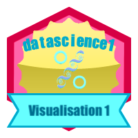

# Moodle {#moodle}

TODO: tout ce chapitre doit encore être écrit. Expliquer les URLs spécialisées à ajouter dans les sections Moodle pour pouvoir récupérer les informations institutionnelles des étudiants dans LearnIt::R.

## Badges

Les badges sont très utiles car ils matérialisent la progression des étudiants. C'est à la fois une façon ludique d'apprendre, et un moyen efficace de pousser un étudiant à travailler. Les badges sont générés dans Moodle, mais bien sûr, ils sont liés à des .... activités Moodle. Avec nos applications externes, nous ne pouvons fournir des badges que manuellement, ce qui devient très vite laborieux.

TODO: trouver un moyen d'automatiser l'octroi de badges. Moodle peut se connecter à https://badgr.io, et nous pouvons peut-être travailler via son interface ? A creuser !

Pour créer des badges, nous pouvons utiliser une [application en ligne](https://www.openbadges.me/designer.html). Il suffit d'indiquer son adresse email, et de concevoir son badge. La même interface peut d'ailleurs être utilisée pour concevoir visuellement des hex-stickers (à faible résolution toutefois puisque c'est des fichiers PNG de 200x200 pixels). Voici un exemple de badge obtenu avec cette application :

## Notes

TODO: il est possible d'envoyer les notes à Moodle via une URL qui renvoie un fichier XML... Explorer cette piste pour créer et mettre à jour les notes Moodle depuis les applis LearnIt::R...
