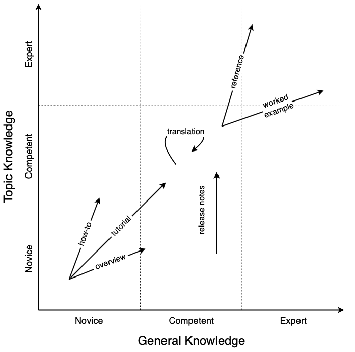
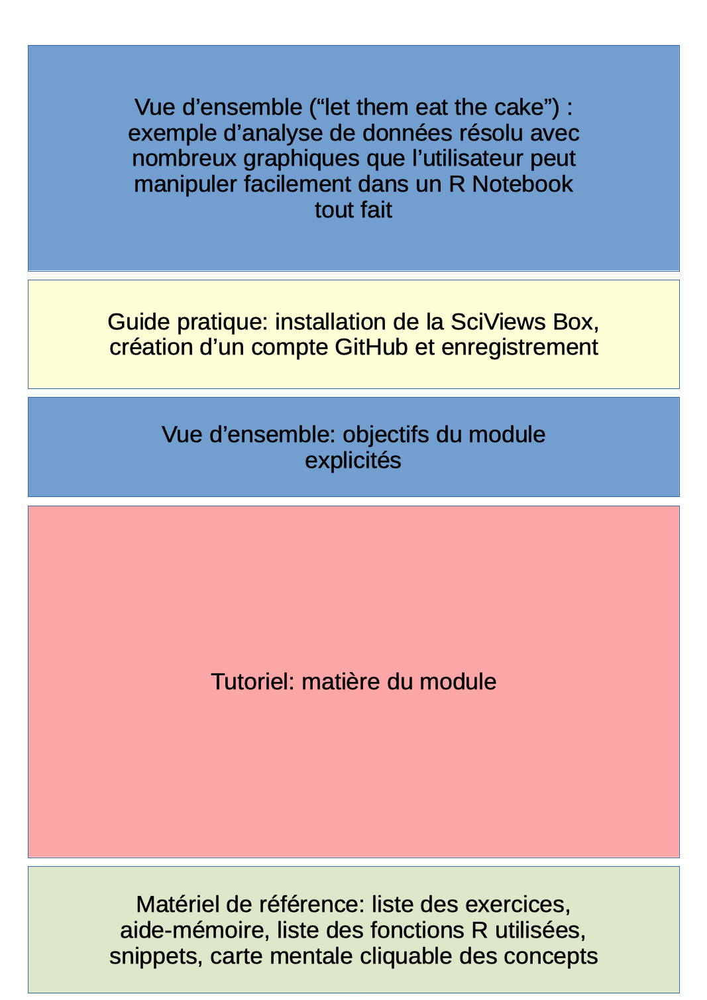

# Divers {#divers}

Cette section reprend différents éléments qui ne rentrent pas (encore) dans les autres catégories.

## Apprentissage

Les neuroscientifiques et les psychologues ont fait beaucoup de progrès ces derniers temps pour comprendre comment le cerveau humain apprend. Ces découvertes ont des retombées importantes au niveau de la pédagogie. Il est donc utile de s'y attarder un peu dans le but de dégager les stratégies d'apprentissage gagnantes (et celles qui sont perdantes).

Le schéma suivant résume comment l'apprentissage se fait dans notre cerveau.

-   Nos organes des sens sont noyés en permanence dans un flux d'informations. Il est impossible de toutes les traiter avec la même attention. Ainsi, un tri est réalisé très tôt et de manière (presque) inconsciente. Tout ce qui n'est pas conservé est bien entendu perdu. Les critères qui motivent le tri de l'information considérée comme utile sont la **motivation** et l'**intérêt**. Par exemple, donner une longue explication à des étudiants *avant* d'avoir suscité leur motivation ou leur intérêt est contre-productif, car cette information sera filtrée et éliminée très tôt sans même être traitée ! C'est le coup classique : s'arrêter en pleine explication et demander à un étudiant au hasard, ou à un étudiant manifestement peu concentré ce qu'on vient de dire... et il est incapable de le répéter ! Donc, arriver à cette situation *est en partie de la faute du professeur*. Il faut qu'il prenne soin de susciter l'intérêt et/ou la motivation *avant* de donner des explications compliquées. Cela peut-être par une phrase du genre : **attention, ce que je vais vous expliquer maintenant vous servira pour faire X ou Y plus tard...** ou **soyez bien attentifs, la procédure suivante est cruciale pour la réussite de l'exercice...**. Cela est également valable dans le matériel pédagogique où il faut bien préciser les objectifs en début de section (et que ces objectifs fassent écho -motivation ou intérêt- dans la tête des étudiants).

\BeginKnitrBlock{note}

Ce qui n'est pas perçu comme "utile" par l'étudiant au moment où cela est formulé est *immédiatement* oublié... C'est ce processus de tri de l'information pertinente qui en est responsable !

\EndKnitrBlock{note}

-   Une fois le filtre du tri franchi, l'information à traiter arrive dans la mémoire de travail à court terme. Cette mémoire permet un traitement rapide de l'information, **mais elle est limitée !** Selon les individus et/ou les circonstances, elle ne dépasse pas l'équivalent de 7-9 "cases" maximum. Il vaut mieux même considérer **cinq cases** disponibles. Chaque case est capable d'accueillir une information à traiter. Cela signifie qu'il faut éviter d'amener trop de difficultés à la fois. si le problème est complexe et nécessite l'assimilation de nombreuses nouvelles notions, il faut alors découper le problème en plusieurs étapes plus simples. Il faut aussi faire attention qu'un certain nombre de ces cases peuvent se remplir par des éléments parasites. Par exemple, un étudiant qui doit installer un logiciel sur son ordinateur, mais qui se bat avec l'écran de login parce qu'il ne l'entre pas correctement, ou parce qu'il n'arrive pas à retrouver son mot de passe, va concentrer son attention et une partie de son "espace de travail" à résoudre ce problème de login. Ensuite, l'espace de travail utilisé ne sera pas directement réutilisable pour la tâche désirée (installation du logiciel). L'étudiant va se sentir débordé par les informations et en conclura qu'il est nul en informatique. Si le même étudiant avait pu se logger directement sans problèmes, il n'éprouverait peut-être pas de telles difficultés.

\BeginKnitrBlock{note}

Il faut toujours garder à l'esprit la taille très limitée de l'espace de travail dans notre cerveau, et ne jamais amener trop de notions nouvelles et/ou difficiles d'un coup. Il faut aussi apprendre à identifier les situations où les étudiants sont saturés d'information. Dans les deux cas, il faut décomposer alors le problème en étapes successives plus simples et attaquer étape par étape.

\EndKnitrBlock{note}

-   Si l'information arrive dans l'espace de travail du cerveau de l'étudiant, ce n'est pas encore gagné pour autant. Il faut en effet bien évidemment qu'il soit capable de traiter le problème. S'il est dans une impasse, tout s'arrête-là ! **Donc, il faut adapter le niveau de difficulté aux connaissances et au potentiel de l'étudiant.** La difficulté ici, c'est qu'une classe est hétérogène. Donc, le niveau de difficulté acceptable n'est pas le même pour tous. Varier le matériel pédagogique et proposer des exercices de niveaux de difficulté différents permet de résoudre ce casse-tête, mais c'est aussi crucial pour l'apprentissage pour une autre raison (voir ci-dessous).

-   Une fois l'information traitée, elle ne mène pas nécessairement à un *apprentissage* pour autant. Notre cerveau a évolué au cours du temps pour économiser ses ressources. Ainsi, ce qui est trop facile à traiter ne mérite pas d'être appris. En effet, dans ce cas on est capable de refaire le même raisonnement facilement si la situation se représente. Donc, notre cerveau va éviter de *mémoriser* des éléments qui paraissent trop simples (le verbe "paraître" est important, car il fait intervenir une sensation.... qui peut être erronée et faire alors perdre la possibilité d'apprendre un concept important).

-   Ainsi une des conditions nécessaires pour que le concept étudié soit transféré dans la mémoire à long terme est qu'il soit raisonnablement difficile (sinon, il ne sera pas digne d'être mémorisé), mais pas trop (si l'étudiant ne peut pas résoudre le problème auquel il fait face, il ne peut rien mémoriser d'utile bien évidemment).

\BeginKnitrBlock{note}

Adapter le niveau de difficulté des activités proposées est à la fois complexe (à cause de l'hétérogénéité des classes) et **indispensable** pour que le mécanisme d'apprentissage s'enclenche. Une façon d'arriver à un niveau de difficulté adéquat, ni trop simple, ni trop difficile, consiste à reporter partiellement cette tâche sur l'étudiant lui-même. Si l'étudiant devient (partiellement) responsable de son processus d'apprentissage, il pourra ajuster partiellement de lui-même le niveau de difficulté (choix des exercices, de leur ordre, de leur timing, avoir recours à l'entre-aide...)

Une approche complémentaire indispensable consiste à varier le niveau de difficulté des exercices proposés autour d'un même concept. Les étudiants les moins performants apprendront avec les exercices les plus simples, même s'ils bloqueront probablement sur les cas les plus complexes. D'un autre côté, le génie survolera ces exercices simples sans rien apprendre, mais s'attardera de manière utile sur les exercices plus difficiles, et c'est là qu'il apprendra le mieux.

\EndKnitrBlock{note}

-   Une autre condition indispensable pour que le mécanisme d'apprentissage s'enclenche, c'est d'être **actif**. Or, écouter un professeur déblatérer sa matière devant un grand auditoire, visionner une vidéo, et parfois même, lire un long texte continu, ce n'est **pas** être actif. L'information "glisse". On dit quelle "entre par une oreille et ressort par l'autre". Et c'est vraiment pratiquement comme cela que cela se passe : le mécanisme d'apprentissage n'est pas activé. Par contre si l'étudiant fait quelque chose pendant ce temps-là, quand il est actif, alors il apprend. Le paradoxe, c'est que l'activité ne doit pas nécessairement être liée à la matière à apprendre. Par exemple, un parent qui cherche à aider son enfant pour apprendre ses devoirs en répétant avec lui sera énervé si l'enfant joue à un jeu vidéo en même temps... Pourtant, c'est l'enfant qui a raison : il est actif (sur son jeu), donc il apprend (sa matière) ! Ce n'est pas logique, mais ainsi fonctionne notre cerveau.

\BeginKnitrBlock{note}

La pédagogie active vise à activer ce mécanisme d'apprentissage par l'activité autant qu'elle reporte la responsabilité de choix de difficulté et de mécanisme d'apprentissage sur l'étudiant lui-même qui doit développer une certaine autonomie pour mettre en place les conditions qui font que, pour lui, l'apprentissage sera optimal. Les enseignants doivent encourager cela. Certains psychopédagogues modernes sont très critiques sur l'enseignement via les grands cours ex cathedras en université. Certains disent que c'est la meilleure méthode pour que la matière passe directement du PowerPoint du prof à la feuille de notes de l'étudiant sans passer par le cerveau du professeur, ni par celui de l'étudiant. **Le mécanisme d'apprentissage est pratiquement inexistant ici, et c'est plus tard, en remettant de l'ordre dans ses notes _de manière active_ que l'étudiant apprendra véritablement la matière.**

\EndKnitrBlock{note}

-   Un dernier point important pour l'apprentissage est la **répétition**. Pour qu'un concept s'imprime durablement dans le cerveau, il faut que les connexions synaptiques soient activées et réactivées *plusieurs fois*. Ceci est un concept connu depuis longtemps en pédagogie, mais qui est parfois mal appliqué. Car si cette répétition est monotone, elle est ennuyeuse. Et alors, la motivation et l'intérêt de l'étudiant sont en chute libre... au point que l'information répétée peut très bien ne plus passer la première barrière du tri. Dans ce cas, la répétition ne sera plus d'aucun effet bénéfique.

\BeginKnitrBlock{note}

Il faut répéter les concepts pour qu'ils s'ancrent durablement dans le cerveau des apprenants. Mais cette répétition ne doit pas être monotone. Donc, il faut multiplier les méthodes de transmission du concept. Le multimédia permet de varier (texte, image, son). On peut aussi diversifier les exercices, approcher de manière ludique, inventer des challenges, etc. **Donc, cette répétiton passe encore une fois par la diversité du matériel pédagogique fourni à l'étudiant autour d'un même concept.**

\EndKnitrBlock{note}

Un leitmotiv, on le voit très clairement ici, qui ressort de tout ceci est qu'il faut **diversifier le matériel pédagogique** autant que possible. C'est notre objectif dans la plateforme pédagogique LearnIt:RR, et c'est pour cela que nous proposons de nombreux outils différents qui ne ressemblent pas du tout à un syllabus qui contient du texte et des images statiques, accompagné de PowerPoints qui contiennent aussi du texte et des images statiques (ou pire, des "animations" qui n'apportent rien à l'apprentissage... la fameuse [mort par PowerPoint](https://openclassrooms.com/fr/courses/3013891-ameliorez-limpact-de-vos-presentations/4172811-evitez-la-mort-par-powerpoint)).

Il n'y a pas que les psychologues et les spécialistes du cerveau qui ont fait des progrès dans la compréhension des mécanismes d'apprentissage. Les techno-pédagogues ont aussi développé des nouvelles techniques et d'autres outils pour mieux apprendre. C'est l'innovation pédagogique dont nous allons reprendre certains éléments dans la section suivante qui nous ont paru importants dans l'élaboration de la plateforme pédagogique LearnIt::R.

## Innovation pédagogique {#innovation}

Cette section reprend différents éléments important qui émergent des constatations faites par les enseignants qui se sont lancés dans l'aventure ainsi que des techno-pédagogues... sans chercher forcément un fil conducteur entre ces différentes idées.

### Différents types de classes inversées

-   Marcel Lebrun de l'Université Catholique de Louvain présente les différents types de classes inversées dans la vidéo suivante :

<!-- -->

À côté de l'approche traditionnelle cours ex cathedras qui présentent la théorie suivis de séances d'exercices ou TP qui mettent en pratique, il y a :

-   la **classe inversée** "traditionnelle" (type 1 selon lui) où les étudiants apprennent la matière à la maison et font les devoirs en classe. Cela reste la théorie d'abord et l'application ensuite. De même, la matière reste imposée par l'enseignant.

-   la **classe renversée** (type 2 dans sa classification). Ici, ce sont les étudiants qui élaborent le matériel pédagogique et le prof est un facilitateur. On explore le contexte d'abord pour définir quoi étudier, et on réalise une analyse et une synthèse ensuite.

-   la classe inversée de type 3 mélange les deux dans un processus itératif de contextualisation -\> décontextualisation -\> recontextualisation.

\BeginKnitrBlock{note}

Il n'y a pas qu'un seul type de classe inversée. On peut renverser les lieux sans toucher au processus (type 1), mais on peut aussi changer les rôles avec la classe renversée où ce sont les étudiants qui élaborent et expliquent le cours au prof (classe renversée). Bien sûr, on peut aussi panacher les deux avec d'autres parties en forme plus classique cours ex cathedras suivis d'exercices.

\EndKnitrBlock{note}

Les différents types de classes inversées peuvent se définir par rapport aux savoirs (qui apporte l'info, le prof ou les élèves ?), et par rapport aux rôles (qui est actif, le prof ou les élèves ?)

### Contextualiser/décontextualiser

Dans son exposé (voir [ici](https://www.youtube.com/embed/U8J24T-eY0U)), Marcel Lebrun fait remarquer que l'enseignement classique expliquer *d'abord* la théorie et passe *ensuite* aux applications. La théorie est une **décontextualisation** du savoir, tandis que les problèmes et applications pratiques en sont une **contextualisation**. Il fait remarquer que cela inverse le processus naturel hors classe, ou l'humain rencontre un problème (le contexte) et cherche à le résoudre en l'étudiant et en cherchant à la généraliser pour ne plus le rencontrer, ou du moins y réagir plus efficacement s'il se reproduit (décontextualisation). Cette constatation mène auy modèle "contextualisation - décontextualisation - recontextualisation"

problème concret et de raisonner à son sujet pour aboutir à de la théorie. Il semble que cette dernière approche soit plus efficace.

\BeginKnitrBlock{note}

L'esprit humain part d'un contexte pour ensuite généraliser (décontextualiser). L'enseignement classique, en présentant la théorie avant les applications inverse ce processus (décontextualisation avant contextualisation). De nombreux indicateurs montrent que ce n'est pas une bonne idée. Donc, l'innovation pédagogique cherche aussi à renverser l'ordre dans le flux d'apprentissage.

\EndKnitrBlock{note}

### Classe renversée

L'approche sous forme de classe renversée est donc la forme la plus extrême. Jean-Charles Cailliez de l'Université de Lille présente ce concept dans la vidéo TEDx suivante :

<!-- -->

Il ne faut pas copier son système, mais en reprendre des éléments et l'adapter au cours à la personnalité de l'enseignant, ...En tous cas, lui va très loin puisque ce sont les étudiants qui font tout (définir la matière, préparer le cours, l'exposer au professeur, préparer les questions de devoirs et d'examens). Le professeur fait les devoirs que les étudiants lui donne et offre ainsi un feedback sur la qualité du travail par cet intermédiaire. Il utilise notamment les QCM (questionnaires à choix multiple) inversés : les étudiants produisent les question, le prof répond, les étudiants corrigent. Si la question est bien posée, le professeur répond bien. Si elle est mal posée, le professeur fait semblant de répondre n'importe quoi pour bien faire comprendre que la question est mal posée. Il utilise aussi le QCM "intelligent" : il ne suffit pas de dire quelles sont les bonnes réponses, mais il faut aussi justifier pourquoi les autres sont fausses pour avoir des points. Au début du cours, chaque équipe crée un tel QCM (cinq questions). Ensuite les QCM passent à l'équipe suivante qui y répond. Enfin, les réponses sont données à une troisième équipe qui corrige (3min à chaque fois, suivi d'une petite discussion).

Cette approche permet aussi de mettre en œuvre le principe suivant : "enseigner est la meilleure façon d'apprendre." Elle est aussi mise en œuvre par Sébastien Bette à l'Université de Mons. Voir aussi les vidéos suivantes :

-   Intervention de Jean-Jacques Cailliez.

<!-- -->

-   Intervention de Sébastien Bette.

<!-- -->

Questions croisées aux deux intervenants.

<!-- -->

#### Intelligence collective

François Taddei parle de la mobilisation de l'intelligence collective au service de nouvelles formes d'apprentissage ici :

<!-- -->

Parmi les points importants de l'innovation pédagogique est l'utilisation de l'intelligence collective. Jean-Jacques Cailliez (voir ci-dessus) fait travailler les étudiants par groupes de six (considéré comme la meilleure taille de groupe). Par contre, c'est lui qui crée les groupes. Après un test d'évaluation qui lui permet de déterminer qui est fort, moyen ou faible, il mets un fort, et un faible systématiquement dans chaque groupe. Ensuite, il demande que les étudiants s'attribuent à chacun un rôle au sein du groupe pour éviter que certains ne fassent rien. Au fil du temps, les responsabilités changent, mais ceci est important pour impliquer tout le monde dès le début. Si un ou plusieurs étudiants ne font rien au sein du groupe, cela plombe l'ambiance puisqu'il y a une partie de la note qui est commune à tout le groupe et ceux qui travaillent se sentent lésés.

La mobilisation de l'intelligence collective passe par la prise de conscience qu'il y a plus dans plusieurs cerveaux que dans un seul et que le travail réalisé à plusieurs est *toujours* de meilleur qualité qu'isolé. De plus, le travail de groupe imprime une toute autre dynamique à l'apprentissage et permet de le varier.

François Taddei parle de la société apprenante comme d'un tout. Il dit que la ségrégation entre apprentissage à l'école, développement de nouveaux savoirs par le recherche et utilisation du savoir ailleurs est artificielle. L'apprentissage est partout et ne se limite pas à l'école. C'est la société apprenante.

Il considère que l'enseignement doit aussi apprendre à apprendre en individuel et en collectif, afin de pouvoir remobiliser plus tard cette capacité sur le terrain. Il faut apprendre tout au long de sa vie car le monde est en évolution permanente. La capacité à se réinventer n'est pas facile à développer et est intimidante. Donc, si on peut la développer dans un cadre bienveillant qu'est l'école, c'est mieux. Dans ce cadre il y a moins d'enjeux, et donc, de pressions. Cela permet d'offrir le **droit à l'erreur**. C'est en faisant des erreurs et en se relevant de ces erreurs qu'on peut progresser le plus.

Concernant les MOOC ("*Massive Open Online Course*"), les universités et écoles ont un défit à relever. Quelle valeur ajoutée proposent-elles face aux MOOC déshumanisés ? C'est une réelle réflexion à avoir. Le défit suivant après le couplage de la recherche et de l'enseignement, c'est de faire de la recherche sur la formation afin de se réinventer en permanence toujours vers de meilleures méthodes d'apprentissage.

### Timing et rythme

Jean-Jacques Cailliez insiste aussi fortement sur l'organisation d'une séance de cours qui doit être **variée et comporter des surprises** afin d'éviter la monotonie et l'ennui des étudiants. Même la meilleure innovation pédagogique, si elle est appliquée de manière répétitive finit par devenir ennuyeuse. Il consacre les 10 à 15 premières minutes du cours avec une forte présence où il propose à chaque fois un petit exercice différent (surprise). Ensuite seulement, les étudiants sont autonomes. A la fin, il clôture souvent par un petit questionnaire où les étudiants donnent leur avis (voir point suivant).

### Explication, implication

L'innovation pédagogique suppose d'autres méthodes d'enseignement qui impliquent que les étudiants doivent *faire un effort pour s'y adapter.* Ils ne sont pas prêts à le faire spontanément et il faut s'attendre à des réticences voire des barrages importants de leur part. Il est donc vital d'**expliquer** et d'**impliquer**.

Avant de modifier la façon dont un enseignement est dispensé, il est vital d'en informer les étudiants. Une séance de une ou deux heures qui explique les méthodes qui seront utilisées et qui les **justifient** avant les cours proprement dits permet de préparer les étudiants aux nouvelles pratiques et aide à leurs acceptations.

Nous pouvons même aller plus loin en leur expliquant que c'est une expérience et que leur avis est crucial (et ensuite leur demander d'indiquer régulièrement deux points positifs et deux points négatifs à chacun pour les impliquer réellement dans le processus). L'implication est encore plus fortement sollicité si, après l'exposé expliquant ce qu'on compte faire, on leur **laisse le choix de le faire ou non**. On les fait voter et on ne tente l'"expérience" que si une majorité est en faveur du changement (mais il faut alors être prêt à laisser tomber).

Aussi, pour les mêmes raisons, il faut être attentif à apporter des innovations de manière graduelle. Le grand coup de pied dans la fourmilière est rarement une bonne approche en matière d'innovation pédagogique !

Quoi qu'il en soit, on ne peut pas contenter tout le monde. Il faut s'attendre en général à 10-15% de mécontents, quel que soit le choix réalisé. Les bons élèves de la classe dans le système traditionnel (les "bachotteurs") se retrouvent en général moins bien dans un système d'innovation poussée telle que la classe renversée. Du coup, ils ont tendance à critiquer négativement l'innovation et sont demandeurs pour revenir à un système plus classique.

### Enseignement basé sur les objectifs

L'enseignement basé sur les objectifs définit *d'abord* les objectifs d'apprentissage et les savoir à acquérir, les concepts à maîtriser. Ensuite, le cours et le matériel pédagogique sont construits progressivement autour des notions clés qui auront été dégagées. Il est possible d'écrire des exercices et des questions pour mettre en pratique et (auto-)évaluer l'acquisition des concepts. Ensuite la partie théorique vient chapeauter le tout sans se perdre dans des digressions inutiles par rapport aux objectifs.

\BeginKnitrBlock{note}

L'enseignement basé sur les objectifs consiste à définir précisément les objectifs d'abord, et ensuite à rester focalisé sur ces objectifs tout au long de l'élaboration du matériel pédagogique et du cours.

\EndKnitrBlock{note}

### Ne pas enseigner les statistiques comme les mathématiques

Douglas Andrews dans [the big mistake: teaching stat as though it were math](https://community.amstat.org/discussions/blogs/blogviewer?BlogKey=784e55b4-cb6c-499a-a2da-391e548d36b2) met en évidence le fait que les cours d'introduction aux statistiques qui sont trop orientés vers le côté mathématique éloignent les étudiants de l'essence même des statistiques et les font fuir. Au contraire, le côté appliqué des statistiques doit plutôt être mis en avant dans les cours introductifs.

La vidéo suivante caricature les interactions entre un biologiste et un statisticien. Ceci montre l'importance de former des personnes capables de faire le lien entre les deux disciplines : les scientifiques des données ayant un "background" en biologie.

<!-- -->

### Attention à la formulation

On a tous tendance à utiliser des tournure comme "il suffit de ...", "cela se fait facilement comme ceci...". Parfois ces tournures sont utilisées pour minimiser la difficulté, ou parce que cela semble effectivement facile pour l'enseignant... qui a oublié les années d'expérience derrière lui qui ont rendu cela facile pour lui. Par contre, l'étudiant qui trouve cela difficile se sentira dévalorisé par cette formulation. Il faut donc éviter ce genre de tournure de phrase : rester neutre, et c'est éventuellement l'étudiant lui-même qui en conclura que c'est facile... ou non.

### Effets psychologiques néfastes

Les enseignants doivent tenir compte également de la psychologie, et en particulier de tout ce qui peut accroître, ou au contraire, impacter la motivation des étudiants. Dans une présentation TEDx, Mark Rober introduit ce qu'il appelle l'"effet Super Mario".

<!-- -->

Le jeu Super Mario est très addictif, parce que le joueur est focalisé sur l'objectif à atteindre (terminer le jeu et sauver la princesse). Cela le détourne des nombreuses embûches qui parsèment le jeu. Au final, l'utilisateur ne fait qu'appuyer successivement sur une série de six boutons (sur la manette de jeu), et présenté autrement, on réalise à quel point la même action peut être perçue négativement. Mark présente six boutons et explique qu'il faudra les appuyer selon une séquence précise... très longue et pendant plus d'une heure pour passer un test. Vu comme cela, cela parait infaisable et totalement rébarbatif... pourtant c'est exactement ce qu'on fait dans le jeu Super Mario qui est, au contraire, addictif.

Il transpose cela aux problèmes de la vie quotidienne. Si on se focalise sur le problème qu'on a juste en face de soi, on est vite tenté d'abandonner. Si au contraire, on se focalise sur un but lointain, mais enviable, les différentes embûches qui se présentent sur notre chemin sont plus facilement traitées. C'est donc l'état d'esprit qui est le plus important pour déterminer si on laisse tomber et perds, ou si on va de l'avant et réussi. **Il y a ici matière à réflexion profonde pour les enseignants, afin de motiver leurs étudiants.**

Mark a aussi étudié le cas d'un problème à résoudre soumis à Internet avec un grand nombre de réponses obtenues. Il permettent d'étudier la motivation vers le succès de manière statistique. Il a comparé deux sous-populations (même question, mais avec une variante subtile). Le premier groupe reçoit 200 points fictifs dès qu'il réussit, quel que soit le nombre d'essais pour y arriver. Le second groupe "perd" cinq points fictifs à chaque tentative infructueuse. Le premier groupe réussi plus souvent et avec une moyenne de 12 tentatives, par rapport à la moyenne de 5 tentatives pour le second groupe. En absolu, la pénalité est très faible et purement fictive (pas de perte d'argent ou autre conséquence quelconque dans la vie réelle). Cependant, la simple idée de "perdre" quelque chose influence profondément les utilisateurs.

\BeginKnitrBlock{note}
Les aspects psychologiques clés autour de la motivation qui fait qu'on résoud un problème ou qu'on le laisse tomber sont cruciaux. L'effet Super Mario montre que la façon dont le problème est présenté, et le but lointain qu'on vise ou non ont un profond impact sur la motivation. De même, l'idée de perdre quelque chose à chaque tentative infructueuse, aussi infime soit cette perte, a un impact non négligeable sur la motivation.

Donc, préciser et rappeler les buts ultimes (vous serez de bons sicentifiques des données dans votre carrière) aide à surmonter les petites difficultés du quotidien. De même, nous devons éviter des cotations qui sanctionnent les étudiants par la perte de points, et promouvoir l'émulation par le gain de points à chaque fois que l'étudiant progresse, au contraire.
\EndKnitrBlock{note}

### Teaching tech together

Dans [son ouvrage](https://teachtogether.tech/en/index.html), Greg Wilson pose un très grand nombre de principes qui fonctionnent bien pour l'enseignement de matières techniques. Au tout début, il définit dix règles :

1.  Be kind: all else is details.
2.  Remember that you are not your learners…
3.  …that most people would rather fail than change…
4.  …and that ninety percent of magic consists of knowing one extra thing.
5.  Never teach alone.
6.  Never hesitate to sacrifice truth for clarity.
7.  Make every mistake a lesson.
8.  Remember that no lesson survives first contact with learners…
9.  …that every lesson is too short for the teacher and too long for the learner…
10. …and that nobody will be more excited about the lesson than you are.

Il y a énormément plus de choses intéressantes dans cet ouvrage, et il faudra prendre le temps de les étudier et digérer plus à fond plus tard !

### Mort par PowerPoint

La présentation de type PowerPoint est partout et les enseignants ne peuvent plus s'en passer. Cependant, c'est un outil à double tranchant et une mauvaise utilisation de cet outil peut être désastreuse. C'est ce qu'on appelle la "mort par PowerPoint".

<!-- -->

Quelques conseils pour améliorer sa présentation PowerPoint ici :

<!-- -->

Don McMillan est un humoriste qui réussit à faire passer le message d'une manière hilarante ici :

<!-- -->

### Ludification de l'enseignement

L'apprentissage par le jeu est une approche intéressante et motivante. Le système de **badges** que l'on gagne en progressant offre des récompenses pour l'effort fourni. Il existe d'autres façon de rendre l'apprentissage plus ludique... et en la matière il faut essayer d'être imaginatif. Concernant la science des données, voici quelques pistes :

-   **challenges** : les étudiants doivent répondre à un problème par équipe et soumettent des solutions à ce problème. La qualité des solution peut être quantifiée (ex : en machine learning, diverses métriques sont utilisables pour évaluer un classifieur). Un ranking est établit et affiché en temps réel. Cet exercice est très motivant et permet également de vérifier les acquis dans un exercice sommatif général.

-   **course de relais** : un jeu de données à analyser, équipes de 4 (1h) ou 6 (1h30). Chaque étudiant a 1/4h pour travailler sur un dépôt GitHub puis fait un commit et passe le dépôt au suivant. Au bout du temps écoulé, le travail est évalué.

-   **ping pong** : par exemple concernant la réalisation de graphiques. Par deux (ou deux binômes) qui s'opposent. On commence avec un chunk vide dans un document R Markdown ou Quarto pour poser le problème (avec un jeu de données à disposition). Le premier doit ajouter une instruction, puis le second, et ainsi de suite. Celui qui perd a soit ajouté une mauvaise instruction, soit l'analyse est terminée et il n'y a plus rien à rajouter (ou le délais max est écoulé et l'étudiant n'a rien pu rajouter).

-   **correction contre la montre** : deux équipes s'affrontent. Chacune encode du code correct dans une app Shiny et propose une version avec une erreur cachée à l'autre équipe. Les corrections sont soumises à quelque chose comme `gradethis::grade_code()` ou des outils de testing qui comparent deux versions de code, la réponse soumise par rapport à la version correcte. La première équipe qui trouve l'erreur a gagné.

-   **quoi d'autre ?** ...

### Let them eat the cake

Le tout début d'un cours (la première heure, voire même les dix premières minutes) sont déterminants pour la suite. Donc, il faut leur faire voir le résultat final et en tous cas, quelque chose de très motivant pour la suite. C'est la méthode prônée par Mine Cetinkaya-Rundel [ici](https://speakerdeck.com/minecr/let-them-eat-cake-first-0a3bbf75-f6f1-42d5-8d2f-ac2ff741611f).

### Differents type de documents

Dans [documentation types](https://third-bit.com/2019/08/08/documentation-types/) Gregory Wilson propose une classification des différents types de documents en fonction du public et du but visé par le document.

-   Le *novice* n'a pas encore de modèle mental du domaine. Il ne sait pas ce qu'il ignore et ne connait pas le jargon.
-   L'*utilisateur compétent* possède un modèle mental du domaine. Il peut exécuter des tâches routinières, peut trouver l'information et est capable de déterminer si ce qu'on lui présente est la solution à son problème ou non.
-   L'*expert* a une vision dense et richement connectée du domaine. Il est capables de résoudre de nombreux problèmes facilement.

Le graphique suivant, [tiré du blog de Gregory Wilson](https://third-bit.com/2019/08/08/documentation-types/) présente différents types de documentations en fonction des connaissances générales (axe X) *versus* les connaissances spécifiques sur la question posée (axe Y). Les flèches indiquent dans quelle direction la documentation amène cet utilisateur. Les types de documentations repris dans le schéma sont décrits plus en détails dans le blog d'origine.

Il faut noter que des documents de type **livre** ou **vignette** ne sont pas inclus dans le diagramme car en réalité, ce sont des documents composites qui contiennent généralement plusieurs sections apparentées à l'un des types repris dans le diagramme. L'**aide-mémoire** est un type particulier de documentation de référence synthétisée en une ou deux pages. Enfin les **bloc-notes informatiques** (comme le R Notebook) sont caractérisés par l'inclusion de code exécutable directement dans le document, mais à part cela, ils peuvent être de n'importe quel autre type.

Par rapport à l'enseignement de la science des données, ce sont les trois types qui visent le novice qui nous intéressent en premier :

-   Le **tutoriel** correspond au type de document à privilégier dans notre matériel pédagogique. Son objectif est de **construire un modèle mental du domaine** ainsi qu'à acquérir quelques compétences de bases permettant de progresser et devenir un utilisateur compétent.

-   L'**overview** (vue d'ensemble) peut être un webinaire, un premier cours, un "elevator pitch", du matériel de marketing... Il informe essentiellement de l'existence de quelque chose, mais sans apporter de compétences supplémentaires (l'utilisation n'apprend pas à résoudre des problèmes). Par rapport au schéma d'apprentissage, ce type de document est utile (et même indispensable) pour éveiller l'intérêt et donc, pour capter l'attention de l'étudiant.

-   Le **how-to** (guide pratique) est une recette étape par étape pour résoudre un problème particulier. Il n'est pas nécessaire de comprendre le pourquoi pour pouvoir l'utiliser. Par contre, c'est le type de documentation qui permettra de résoudre un problème particulier le plus vite possible, mais ne change rien aux connaissances générales du domaine de l'utilisateur.

Nous voyons donc que les vues d'ensemble et les guides pratiques sont à réserver à des situation particulières : éveil de l'intérêt en début de cours ou de module pour les premiers, résoudre rapidement un problème pour pouvoir passer à autre chose pour les seconds (par exemple : installer le logiciel requis le plus vite possible pour pouvoir se concentrer sur les exercices ensuite). Sinon globalement, le matériel pédagogique doit se structurer essentiellement comme un tutoriel.

Cependant, il ne faut pas négliger non plus de la documentation complémentaire qui sera utile lorsque l'étudiant deviendra compétent : le matériel de **référence** (dont les aides-mémoires, foires aux questions, cartes mentales, aides en ligne des fonctions de R) et les résolutions de cas (**worked examples** dont les check-listes et les snippets font partie). En effet, une fois qu'il a assimilé les notions, le document de type tutoriel qu'il a utilisé jusqu'ici ne présente *pas* l'information d'une manière telle qu'elle soit facile à retrouver. Les points importants sont trop délayés (développement étape par étape, mélange d'exemples et de théorie, etc.). Donc, il faut *résumer* les notions importantes dans des documents de référence également fournis aux étudiants et leur apprendre à les utiliser et à passer des uns (tutoriels) aux autres (références). **Fournir seulement un syllabus bien construit comme un tutoriel ne suffit pas car le novice devenu utilisateur compétent à son usage se retrouve alors face à un document qui est inadapté comme documentation de référence.** Une approche à expérimenter serait de faire élaborer (au moins partiellement) le matériel de référence par les étudiants. Ceci va dans le sens de la pédagogie active et du concept de classe renversée, mais tout en guidant plus fortement la matière à étudier puisqu'on part d'un syllabus/tutoriel qui cadre le travail.

La scénarisation du cours est importante, mais également la scénarisation du matériel pédagogique. Un point de vue qui paraît essentiel ici est de bien définir le type de documentation pour chaque partie d'un chapitre *avant* de l'écrire et ensuite de se tenir au style et aux objectifs relatifs à ce type de documentation. L'illustration suivante est une tentative de scénarisation d'un module en fonction de quatre **types de documents**, présentés ici en couleurs différentes. Ceci semble complémentaire à la définition du contenu en terme de **notions à enseigner** et d'**acquis d'apprentissage** visés par le module qui définissent *quoi* enseigner, alors que la présentation par types de documents indique *comment* l'enseigner.

